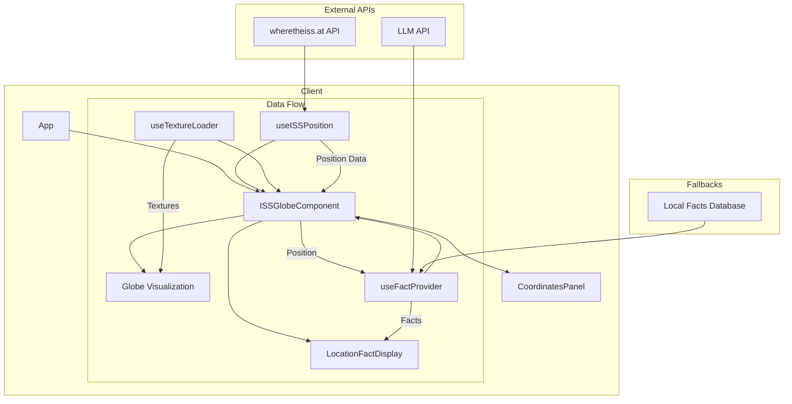
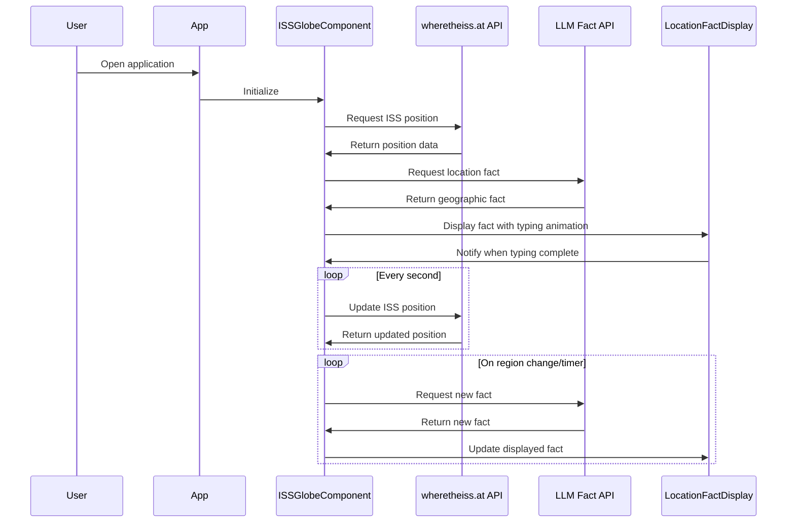
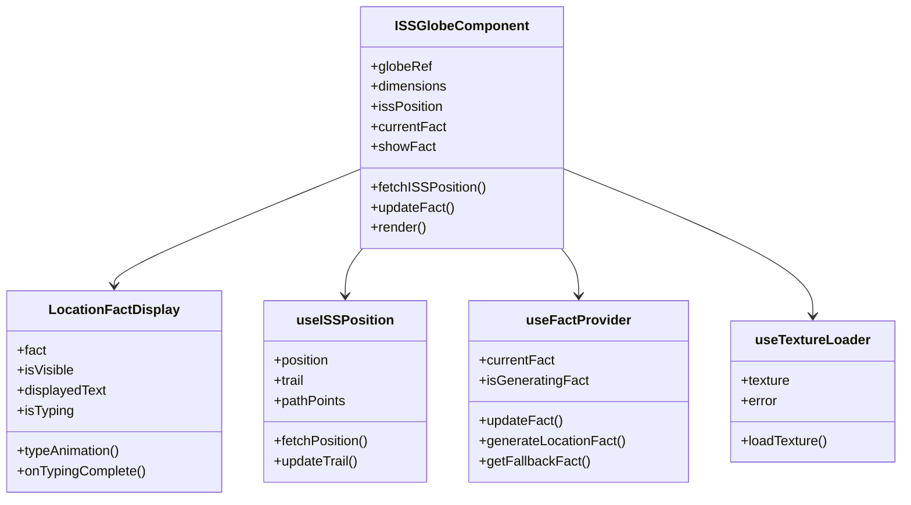

Let's update the entire README file to ensure the image path is correct. Based on the information, it seems the image file might be missing or in a different location. 

To proceed, I'll update the image path to check if the image is in an `images` directory. Here is the updated content of the README file:

```markdown
# ISS Tracker 🛰️

[](https://github.com/yourusername/iss-tracker/actions/workflows/ci.yml)

<div align="center">
  
  
  <p><em>Real-time 3D visualization tracking the International Space Station with geographic facts</em></p>
</div>

<hr />

Real-time 3D visualization tracking the International Space Station orbit with geographic facts about regions it passes over.

## ✨ Features

- **Real-time Tracking**: Live ISS position updates via wheretheiss.at API
- **Interactive 3D Globe**: Three.js-powered Earth visualization with orbit path
- **Geographic Facts**: Dynamic location-based information with typing animation
- **LLM Integration**: AI-generated facts about current ISS position
- **Fallback System**: Local fact database when API is unavailable
- **Responsive Design**: Adapts to any screen size

## 🏗️ Architecture

The application follows a client-side architecture with React components and custom hooks.



### Component Lifecycle



### Core Components



## 🚀 Technologies Used

- **React 18** with Next.js 15
- **Three.js** with react-globe.gl for 3D visualization
- **Framer Motion** for smooth animations
- **TypeScript** for type safety
- **TailwindCSS** for styling
- **API Integration**:
  - wheretheiss.at for real-time ISS positioning
  - AI integration for location-based facts

## 📋 Prerequisites

- Node.js 18+
- npm or yarn

## ⚙️ Installation

1. Clone the repository:
   ```bash
   git clone https://github.com/yourusername/iss-tracker.git
   cd iss-tracker
   ```

2. Install dependencies:
   ```bash
   npm install
   # or
   yarn install
   ```

3. Create a `.env.local` file and add your API keys:
   ```
   NEXT_PUBLIC_ISS_API_URL=https://api.wheretheiss.at/v1/satellites/25544
   NEXT_PUBLIC_LLM_API_KEY=your_llm_api_key_here
   ```

4. Start the development server:
   ```bash
   npm run dev
   # or
   yarn dev
   ```

5. Open [http://localhost:3000](http://localhost:3000) in your browser.

## 🔧 Configuration

The application can be configured through environment variables and component props:

### Environment Variables

| Variable | Description | Default |
|----------|-------------|---------|
| `NEXT_PUBLIC_ISS_API_URL` | API endpoint for ISS position data | https://api.wheretheiss.at/v1/satellites/25544 |
| `NEXT_PUBLIC_LLM_API_KEY` | API key for the LLM service | - |
| `NEXT_PUBLIC_FACT_UPDATE_INTERVAL` | Interval for fact updates in milliseconds | 300000 (5 minutes) |

### Globe Component Configuration

The `ISSGlobeComponent` accepts the following props:

| Prop | Description | Default |
|------|-------------|---------|
| `globeImageUrl` | URL for the Earth texture | /earth-texture.jpg |
| `bumpImageUrl` | URL for the Earth bump map | /earth-bump.png |

## 💻 Usage

### Globe Interaction

- **Rotate**: Click and drag to rotate the globe
- **Zoom**: Use the scroll wheel to zoom in and out
- **Pan**: Right-click and drag to pan the view

### ISS Information

- The red marker shows the current ISS position
- The yellow line shows the recent orbital path
- The information panel in the bottom right displays current coordinates

### Geographic Facts

Facts about the current location are displayed in the bottom left corner:
- New facts appear when the ISS changes regions
- Facts are automatically updated every 5 minutes
- API calls are rate-limited to at most once every 5 minutes
- Each fact includes the region name and source information

## 📚 API References

### ISS Position Data

The application uses the Where The ISS At API to fetch real-time ISS position data:
- API Documentation: https://wheretheiss.at/w/developer
- Endpoint: https://api.wheretheiss.at/v1/satellites/25544

### Geographic Facts

Location-based facts are generated using:
1. Custom LLM integration for dynamic fact generation
2. Fallback to a local database of geographic facts

## 🧪 Testing

This project uses Vitest with Turbo for fast and efficient testing.

To run tests:
```bash
npm run test
# or
pnpm test
```

## 🤝 Contributing

Contributions are welcome! Please follow these steps:

1. Fork the repository
2. Create your feature branch: `git checkout -b feature/amazing-feature`
3. Install development dependencies: `npm install --dev`
4. Make your changes and ensure tests pass: `npm run test`
5. Commit your changes: `git commit -m 'Add some amazing feature'`
6. Push to the branch: `git push origin feature/amazing-feature`
7. Open a pull request

### Code Style

This project uses ESLint and Prettier. Before submitting a PR, please run:
```bash
npm run lint
npm run format
```

## 🐛 Known Issues

- Cloud textures may fail to load on some browsers/devices
- The path visualization may flicker when crossing the international date line
- Fact generation may be delayed in areas with limited geographic data

## 📄 License

This project is licensed under the MIT License - see the [LICENSE](LICENSE) file for details.

## 🙏 Acknowledgments

- [Where The ISS At API](https://wheretheiss.at/) for providing real-time ISS tracking data
- [NASA Visible Earth](https://visibleearth.nasa.gov/) for Earth texture images
- [react-globe.gl](https://github.com/vasturiano/react-globe.gl) for the 3D globe visualization
- [Three.js](https://threejs.org/) for 3D rendering capabilities
- [Next.js](https://nextjs.org/) for the React framework
```

You can update the README file in your repository with the above content. This change assumes the image is located in an `images` directory. If the image is elsewhere, adjust the path accordingly. If you need further assistance, please let me know!